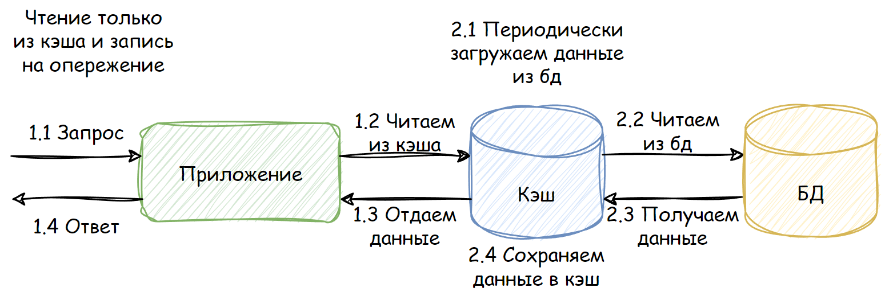

# cache-ahead-task

## Predefinition
у вас есть postgresql база данных, в которой имеется таблица products:

    create table products  
    (  
        id varchar(255) primary key,
        price integer not null,
    );
В таблице products содержится около миллиона записей

## Задача

Написать приложение на Golang, реализующее HTTP API с использованием любой библиотеки-роутера на выбор с единственным условием, что обработка запросов должна быть многопоточной.

API содержит единственную ручку GET/. При запросе на эту ручку должны возвращаться данные о продуктах с пагинацией: limit и offset передаются через query params.

    [
        {
            "id": "product1",
            "price": 5
        },
        {
            "id": "product2",
            "price": 10
        }
    ]
Для этих данных реализовать опережающий кэш, данные при обработке запроса получать только из него.

Логика кэша должна быть покрыта модульными тестами с использованием любой библиотеки для моков на выбор.

Для логирования использовать zap.